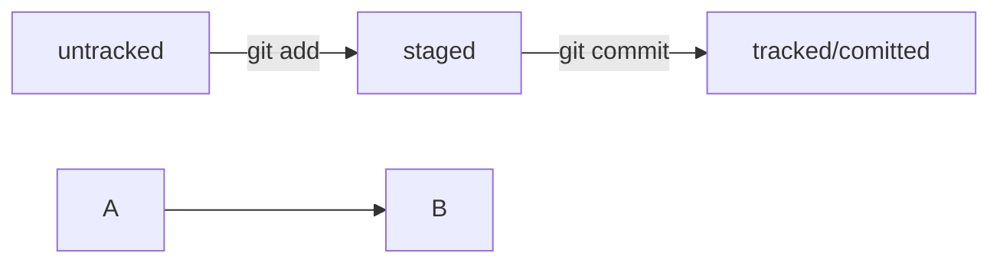

# Шпаргалка по Git

## Создание локального репозитория Git:

* Инициализация нового репозитория:
```git init```

* Добавление файлов к коммиту:
```git add <файл1> <файл2>```

* Создание коммита:
```git commit -m "Ваш комментарий"```
<br>


## Работа с удаленным репозиторием (GitHub):

* Добавление удаленного репозитория:
```git remote add origin <URL_репозитория_GitHub>```

* Отправка изменений на GitHub:
```git push -u origin master```

* Получение изменений с GitHub:
```git pull origin master```
<br>


## Ветвление:

* Создание новой ветки:
```git branch <название_ветки>```

* Переключение на другую ветку:
```git checkout <название_ветки>```

* Объединение веток:
```git merge <название_ветки>```
<br>


## Регистрация на GitHub:

* Создание аккаунта на GitHub:

Перейдите по [ссылке](https://github.com/ "github") и следуйте инструкциям.
<br>
* Добавление SSH-ключа:

[Генерация SSH-ключа](https://docs.github.com/en/authentication/connecting-to-github-with-ssh/generating-a-new-ssh-key-and-adding-it-to-the-ssh-agent "Жми, да?")
<br>
[Добавление SSH-ключа на GitHub](https://docs.github.com/en/authentication/connecting-to-github-with-ssh/adding-a-new-ssh-key-to-your-github-account "А не хочешь, не жми")
<br>


## Инфа про хеши:

Хеши в Git являются ключевым элементом и представляют собой уникальные идентификаторы для каждого коммита. Хеши в Git играют ключевую роль в обеспечении целостности данных, отслеживании изменений и предоставлении уникальной идентификации каждому коммиту.
<br>Вот несколько полезных фактов о хешах в коммитах Git:

* Уникальность хеша:
Хеш коммита представляет собой уникальную строку символов. Изменение хотя бы одного бита в коммите приведет к созданию совершенно другого хеша.

* SHA-1 алгоритм:
Git использует алгоритм хеширования SHA-1 для генерации хешей коммитов. Он создает фиксированную строку длиной в 40 символов.

* Уникальность коммита:
Хеш коммита формируется на основе метаданных коммита, включая содержимое, автора, дату и родительский коммит. Это обеспечивает уникальность для каждого коммита.

* Ссылка на коммит:
Хеш используется для обращения к конкретному коммиту. Вы можете использовать его для проверки истории, создания веток, и переключения между коммитами.

* Краткость идентификатора:
Хеши создаются в виде длинных строк, но обычно используется лишь первые несколько символов (например, первые 7 или 8) для идентификации коммитов.

* Неизменяемость хеша:
Хеш коммита неизменен после создания коммита. Это обеспечивает стабильность идентификации коммита в истории проекта.

* Отслеживание изменений:
Любые изменения в коммите (включая его содержимое) приведут к изменению хеша. Это позволяет Git эффективно отслеживать историю изменений.
Хеши в Git играют ключевую роль в обеспечении целостности данных, отслеживании изменений и предоставлении уникальной идентификации каждому коммиту.
<br>


## Инфа про git log:

Команда git log в Git предоставляет историю коммитов для репозитория. 
<br>Вот несколько полезных аспектов о команде git log:

* Базовый вывод:
Простой вызов git log покажет список коммитов, начиная с последнего и работая в обратном хронологическом порядке.

* Коммиты и их хеши:
Вывод git log содержит хеши каждого коммита. Эти хеши используются для идентификации и обращения к конкретным коммитам.

* Автор и дата:
Команда git log отображает информацию об авторе каждого коммита и дате его создания.

* Краткость вывода:
По умолчанию, вывод git log может быть довольно подробным. Можно использовать опции форматирования или флаги, такие как --oneline для более краткого представления.

* Просмотр изменений:
Флаг -p или --patch позволяет просмотреть изменения, внесенные каждым коммитом.

* Фильтрация по автору:
Можно использовать --author для фильтрации коммитов по автору.
<br>


## Инфа про Head:

Все, что нужно знать:
* В числе прочих файлов в папке .git есть служебный файл HEAD. Он указывает на самый свежий коммит.

* Вместо хеша последнего коммита можно написать слово HEAD — Git вас поймёт.
<br>


## Инфа про статусы файлов:


<br>


## Инфа про git status:

Все, что нужно знать:
* Команда git status всегда подскажет, что происходит с файлом: например, он добавлен в список «на коммит» или ещё вообще не отслеживается, или изменён.

* git status показывает явно следующие состояния файлов: untracked, staged и modified.

* git status подсказывает, какие команды можно выполнить, чтобы поменять состояние файла.
